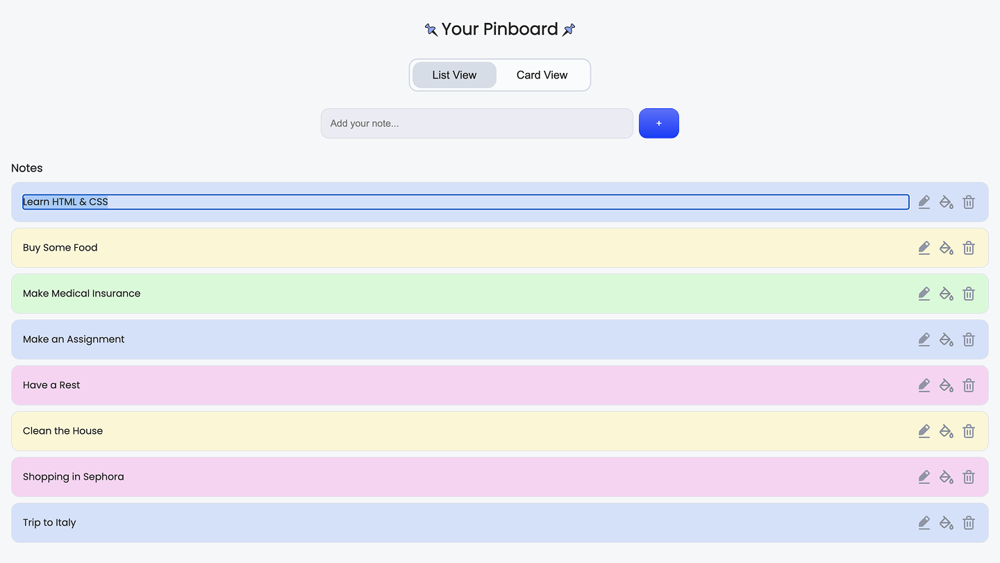

# Assignment  01

## Brief

Starting from the concept of a pinboard, implement a web page that:

- is responsive (properly layout for smartphone, tablet, and desktop)
- allows the user to add and remove elements
- allows the user to coustomize elements (i.e. colors, size)
- allows the switch between two views (at least)

## Screenshots

## Project description

General concept is the pinboard where the user can pin some notes. About the functionality, user can add and delete notes,edit them, switch between 2 views, and customize note by changing it's color. Also there is a possibility to work on different devices because the page is responsive.

## Lista funzioni 

1) Note adding: using the input field and putting a  text inside you can create a note by clickingon  the "+" button.
2) Note deleting: if you don't need a note anymore or you made a mistake, you can easily delete it using  the "trashbin" button.
3) Color change: for the user convenience he can customize notes changing it's color making such a categorization by himself. For example: all  blue notes - for study category, green - medicine etc.
(by default every new note is adding in blue)
4) Edit note: by clicking on the "edit" button you can rewrite a content inside the existing note.
5) View switch: user can switch between 2 views and use the pinboard in the most comfortable way for him/her.