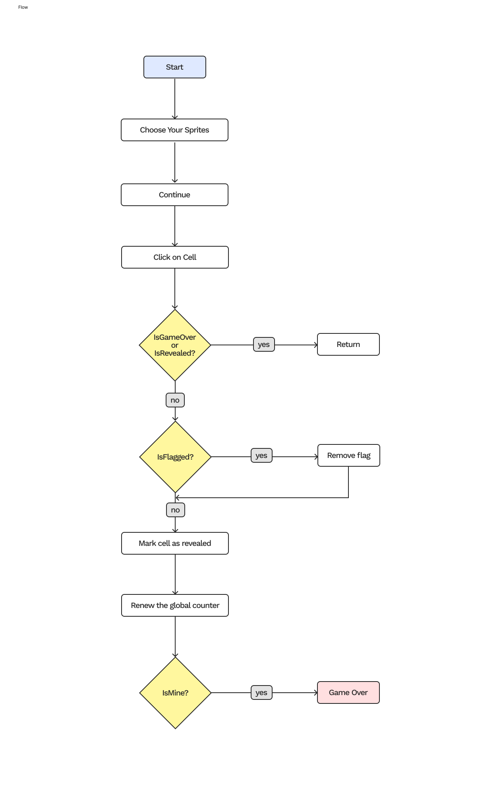

## Brief

Choose a “mini-game” to rebuild with HTML, CSS and JavaScript. The requirements are:

- The webpage should be responsive
- Choose an avatar at the beginning of the game
- Keep track of the score of the player
- Use the keyboard to control the game (indicate what are the controls in the page). You can also use buttons (mouse), but also keyboard.
- Use some multimedia files (audio, video, …)
- Implement an “automatic restart” in the game (that is not done via the refresh of the page)

## Screenshots

## Project Description

Minesweeper is a game where mines are hidden in a grid of squares. Safe squares have numbers telling you how many mines touch the square. You can use the number clues to solve the game by opening all of the safe squares. If you click on a mine you lose the game!

## Block diagram

## List of the functions

**1) initializeSpriteSelection()**: Description: Initializes the sprite selection dialog by setting up event listeners for bomb and flag sprite options, clears all previous selections, and highlights the previously selected sprites (or defaults to the first option). Returns nothing.

**2) showSpriteSelectionDialog()**: Description: Displays the sprite selection dialog modal to allow the player to choose bomb and flag sprites before starting the game. Returns nothing.

**3) startGame()**: Description: Resets and initializes a new game session by clearing the board, resetting game state variables (score, revealed cells count, game over status), creating a new board grid, placing mines randomly, calculating neighbor mine counts, and setting focus on the first cell. Returns nothing.

**4) createBoard()**: Description: Creates the game board grid by generating cell elements for each position, setting up click and right-click event listeners, and storing cell data in a 2D array. Returns nothing.

**5) placeMines()**: Description: Randomly places the specified number of mines on the board grid at random positions, ensuring no cell has more than one mine. Returns nothing.

**6) calculateNeighbors()**: Description: Calculates and stores the number of adjacent mines for each non-mine cell on the board by checking all 8 surrounding cells. Returns nothing.

**7) revealCell(cellData)**: Param - cellData: object containing cell information (element, row, col, isMine, mineCount, isRevealed, isFlagged). Description: Reveals a cell when clicked, removes flag if present, increments score if safe, triggers game over if mine is hit, or recursively reveals neighbors if cell has no adjacent mines. Returns nothing.

**8) revealAllMines()**: Description: Reveals all mine cells on the board when the game is lost by adding the 'revealed' and 'mine' classes and applying the selected bomb sprite. Returns nothing.

**9) revealNeighbors(row, col)**: Param - row: row index of the cell, col: column index of the cell. Description: Recursively reveals all neighboring cells that have no adjacent mines, removing flags if present, incrementing score, and continuing the cascade for cells with zero adjacent mines. Returns nothing.

**10) checkWinCondition()**: Description: Checks if the player has won by comparing the number of revealed cells to the total number of safe cells (total cells minus mines). If won, sets game over status, updates high score, shows win dialog, and plays win sound. Returns nothing.

**11) showdialog(message)**: Param - message: text message to display in the dialog. Description: Displays a modal dialog with the given message and current score, used for game over and win notifications. Returns nothing.

**12) updateScoreDisplay()**: Description: Updates both the current score and high score display elements in the UI with the current values. Returns nothing.

**13) updateHighScoreIfNeeded()**: Description: Checks if the current score exceeds the high score and updates it if necessary, then refreshes the score display. Returns nothing.

**14) toggleFlag(cellData)**: Param - cellData: object containing cell information. Description: Toggles the flag state of a cell (places or removes a flag) by updating the cell's flagged status, toggling CSS classes, and applying or removing the selected flag sprite image. Returns nothing.

**15) updateFocus(cellData)**: Param - cellData: object containing cell information. Description: Updates the visual keyboard focus indicator by removing focus from the previously focused cell and adding a blue border to the newly focused cell. Returns nothing.
