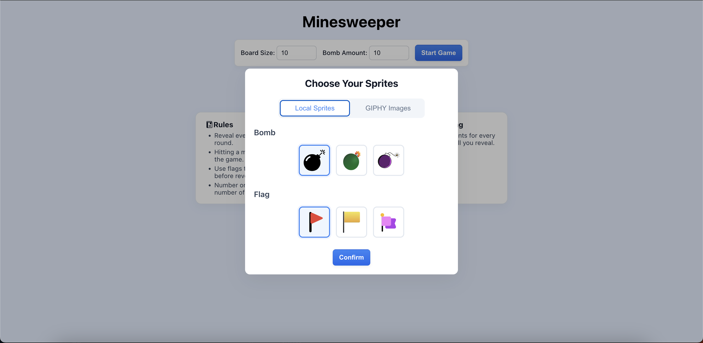
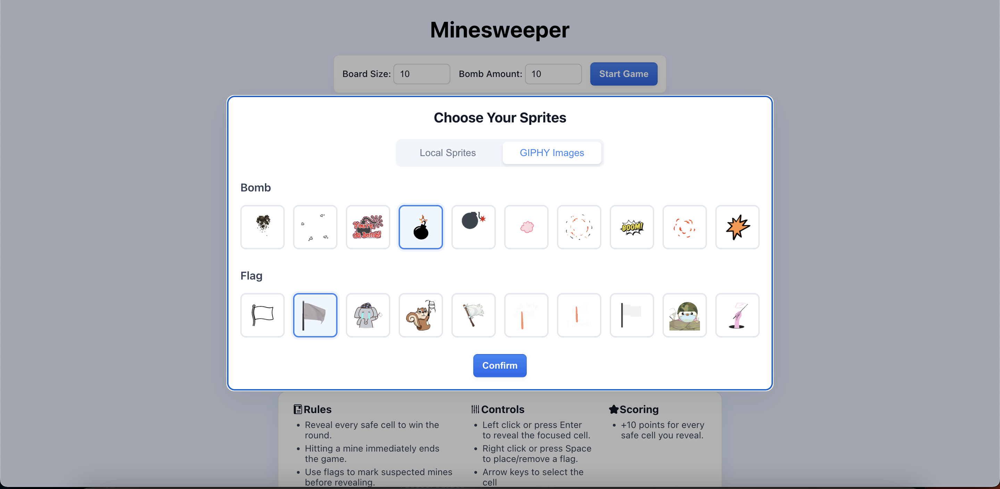
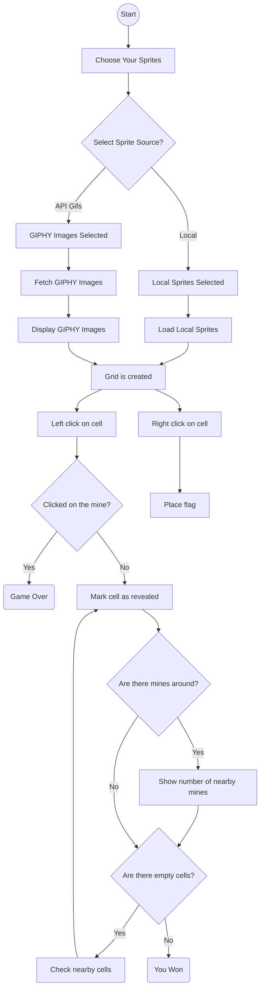

## Brief

Upgrade the Assignment 02 by adding the use of data coming from an external web API. For example, fetch contents (audio, images, video, text, metadata) from online archives, AI generated contents (chatGPT API), data (weather, realtime traffic data, environmental data).

The application **must** have those requirements:

- The webpage is responsive
- Use a web API (you choose which one best fists for your project) to load the data and display them in the webpage
- At least one multimedia file (for user feedback interactions, or content itself)
- Develop a navigation system that allows the user to navigate different sections with related content and functionalities

## Screenshots

## Project Description

Minesweeper is a game where mines are hidden in a grid of squares. Safe squares have numbers telling you how many mines touch the square. You can use the number clues to solve the game by opening all of the safe squares. If you click on a mine you lose the game!

## Block diagram

## List of the functions

**1) initializeSpriteSelection()**: Description: Initializes the sprite selection dialog by setting up event listeners for bomb and flag sprite options, clears all previous selections, and highlights the previously selected sprites (or defaults to the first option). Returns nothing.

**2) showSpriteSelectionDialog()**: Description: Displays the sprite selection dialog modal to allow the player to choose bomb and flag sprites before starting the game. Initializes toggle buttons for switching between local sprites and GIPHY images, sets the initial state based on the current source, and shows the appropriate sprite options. Returns nothing.

**3) startGame()**: Description: Resets and initializes a new game session by clearing the board, resetting game state variables (score, revealed cells count, game over status), creating a new board grid, placing mines randomly, calculating neighbor mine counts, and setting focus on the first cell. Returns nothing.

**4) createBoard()**: Description: Creates the game board grid by generating cell elements for each position, setting up click and right-click event listeners, and storing cell data in a 2D array. Returns nothing.

**5) placeMines()**: Description: Randomly places the specified number of mines on the board grid at random positions, ensuring no cell has more than one mine. Returns nothing.

**6) calculateNeighbors()**: Description: Calculates and stores the number of adjacent mines for each non-mine cell on the board by checking all 8 surrounding cells. Returns nothing.

**7) revealCell(cellData)**: Param - cellData: object containing cell information (element, row, col, isMine, mineCount, isRevealed, isFlagged). Description: Reveals a cell when clicked, removes flag if present, increments score if safe, triggers game over if mine is hit, or recursively reveals neighbors if cell has no adjacent mines. Returns nothing.

**8) revealAllMines()**: Description: Reveals all mine cells on the board when the game is lost by adding the 'revealed' and 'mine' classes and applying the selected bomb sprite. Returns nothing.

**9) revealNeighbors(row, col)**: Param - row: row index of the cell, col: column index of the cell. Description: Recursively reveals all neighboring cells that have no adjacent mines, removing flags if present, incrementing score, and continuing the cascade for cells with zero adjacent mines. Returns nothing.

**10) checkWinCondition()**: Description: Checks if the player has won by comparing the number of revealed cells to the total number of safe cells (total cells minus mines). If won, sets game over status, updates high score, shows win dialog, and plays win sound. Returns nothing.

**11) showdialog(message)**: Param - message: text message to display in the dialog. Description: Displays a modal dialog with the given message and current score, used for game over and win notifications. Returns nothing.

**12) updateScoreDisplay()**: Description: Updates both the current score and high score display elements in the UI with the current values. Returns nothing.

**13) updateHighScoreIfNeeded()**: Description: Checks if the current score exceeds the high score and updates it if necessary, then refreshes the score display. Returns nothing.

**14) toggleFlag(cellData)**: Param - cellData: object containing cell information. Description: Toggles the flag state of a cell (places or removes a flag) by updating the cell's flagged status, toggling CSS classes, and applying or removing the selected flag sprite image. Returns nothing.

**15) updateFocus(cellData)**: Param - cellData: object containing cell information. Description: Updates the visual keyboard focus indicator by removing focus from the previously focused cell and adding a blue border to the newly focused cell. Returns nothing.

**16) fetchGiphyImages(query, limit = 10)**: Param - query: search term for GIPHY API, limit: maximum number of images to fetch (default 10). Description: Fetches sticker images from the GIPHY API based on the search query, handles API errors, and returns an array of image objects containing URL and title properties. Returns array of image objects with url and title properties, or empty array on error.

**17) loadGiphyImages()**: Description: Asynchronously loads GIPHY images for both bomb and flag sprites by fetching images in parallel, displays loading states, handles errors, creates sprite option elements for each image, and applies scrollable styling. Caches the fetched images for reuse. Returns nothing.

**18) showLocalSprites()**: Description: Displays the local sprite options (3 bomb and 3 flag sprites) by clearing GIPHY images, hiding loading/error states, applying centered styling for local sprites, and re-initializing sprite selection event listeners. Returns nothing.

**19) showGiphySprites()**: Description: Displays GIPHY sprite options by either loading new images from the API (if not cached) or re-rendering previously cached images. Applies scrollable styling for GIPHY sprites and re-initializes sprite selection. Returns nothing.

## Content and data sources

Images for local sprites were taken from iconScout.
https://iconscout.com/icons?gad_campaignid=16899648377&gad_source=1&gbraid=0AAAAABZ_80S49Lrv61q9GgOo4oQGYAHkQ&gclid=Cj0KCQiAubrJBhCbARIsAHIdxD85lQld6c-l5M-DaWvFybyg9eHjJr4bk6pEckewIXPMpJ3ech9cvoUaArMzEALw_wcB

Sounds were taken from ZvukiPro.com.
https://zvukipro.com/games/2685-zvuki-iz-igry-saper.html

## API documentation
You can select game sprites from local files or by fetching from an API (https://developers.giphy.com/docs/api/). 